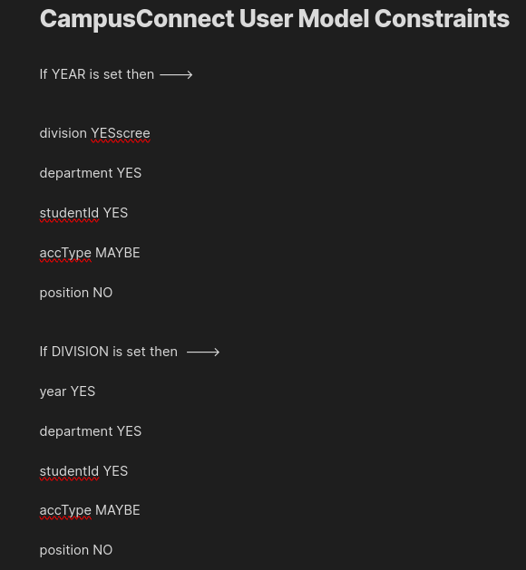
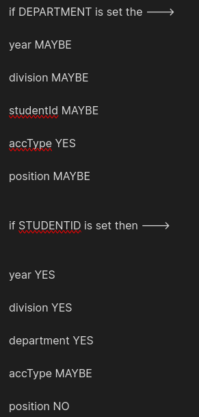
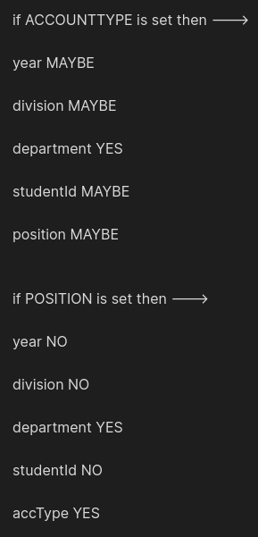

# Enviornment variables

## Backend env structure

```bash
PORT = 8000
JWT_SECRET = 123
MONGO_URI = mongodb://localhost:27017/CampusConnectSelf
ORIGIN = http://localhost:5173/
REPL_SET = rs0Me
```

# Setting up a replication set in ubuntu

#### Replication set is necessary because the code uses transaction

# Installation

You should already have mongodb installed locally

### Open the MongoDB configuration file on your machine for editing:

```bash
sudo nano /etc/mongod.conf
```

### Modify the following lines in the configuration file:

```bash
replication:
  replSetName: "rs0Me"
```

!!! You have to use this name in .env file '**REPL_SET**'

### Restart mongodb

```bash
sudo systemctl restart mongod
```

### In windows run the following command in command prompt

```bash
mongod --port 27018 --replSet "rs0Me" --dbpath "C:\data\db1" --bind_ip localhost
```

# Images of User Schema Logic




